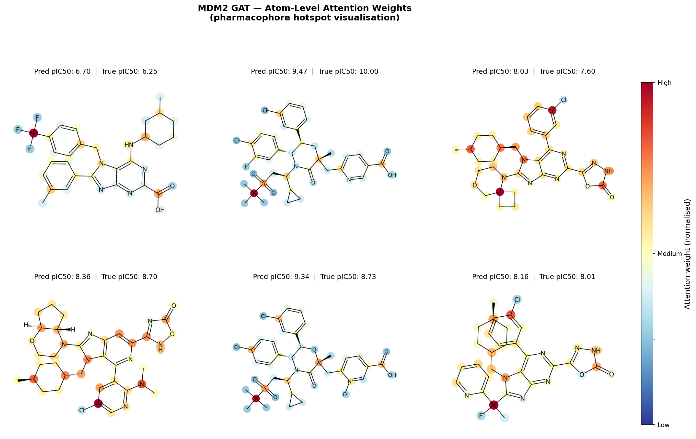

# MDM2 Graph Attention Network (GAT)

A Graph Attention Network for predicting MDM2 inhibitor potency (pIC50) with atom-level attention visualisation.

Companion project to the MDM2-QSAR pipeline — compares classical ML (Random Forest) against deep learning (GAT) on the same dataset.

## Results

| Model | R² | RMSE |
|-------|-----|------|
| Graph Attention Network | 0.655 | 0.776 |
| Random Forest (baseline) | 0.700 | 0.724 |

Random Forest outperforms GAT on this dataset — consistent with published literature showing classical ML often outperforms deep learning on small molecular datasets (<10k compounds).

## Attention Visualisation

The GAT model produces atom-level attention weights showing which atoms drive the potency prediction. Red atoms received high attention, blue atoms low attention — effectively highlighting the model's learned pharmacophore.



## Pipeline

1. `data_preparation.py` — converts SMILES to molecular graphs (nodes=atoms, edges=bonds)
2. `model.py` — 3-layer GAT architecture, 4 attention heads, 137k parameters
3. `train.py` — training with early stopping and learning rate scheduling
4. `evaluate.py` — GAT vs Random Forest comparison
5. `visualise.py` — attention weight extraction and pharmacophore visualisation
6. `optimise_hyperparameters.py` — Optuna search over architecture/training hyperparameters
7. `predict_with_uncertainty.py` — MC Dropout confidence intervals on predictions
8. `collect_brd4_data.py` / `brd4_data_preparation.py` / `train_brd4.py` — same pipeline applied to a second, unrelated target (BRD4)

## Second target: BRD4 (generalisation check)

The architecture, training loop and featurisation are all target-agnostic — nothing in the pipeline is MDM2-specific. To check the model isn't just overfit to quirks of one 4k-compound dataset, the same GAT was retrained from scratch on BRD4 (Bromodomain-containing protein 4, `CHEMBL1163125`), a completely different drug target with its own ChEMBL bioactivity data (7,966 compounds after cleaning).

| Dataset | Compounds | Test R² | Test RMSE |
|---------|-----------|---------|-----------|
| MDM2 | 4,146 | 0.655 | 0.776 |
| BRD4 | 7,966 | 0.564 | 0.783 |

Same architecture, same hyperparameters, same training code — comparable performance on a target it has never seen, which is the point: this is a general small-molecule GAT pipeline, not a one-off fit to MDM2.

To reproduce: `python collect_brd4_data.py && python brd4_data_preparation.py && python train_brd4.py`

## Hyperparameter optimisation (Optuna)

`optimise_hyperparameters.py` searches `hidden_channels`, `num_heads`, `dropout`, `learning_rate`, `weight_decay` and `batch_size` with Optuna's TPE sampler and median pruning, instead of relying on the hand-picked defaults used in `train.py`. Each trial trains a fresh model with early stopping on validation loss.

In this environment (CPU-only), a full sweep is slow — each trial is a full training run. A short demonstration sweep found `hidden_channels=64, num_heads=2, dropout≈0.03, lr≈0.0054, batch_size=64` outperforming a `hidden_channels=32, num_heads=8` config, which lines up with `train.py`'s existing defaults (`hidden_channels=64, num_heads=4`). The script itself is unchanged by that time budget — `N_TRIALS`, `MAX_EPOCHS_PER_TRIAL` and `PATIENCE` at the top of the file control sweep size, and it's designed to be re-run with a larger budget on a GPU or given more time. Results are saved to `checkpoints/best_hyperparameters.json`.

To reproduce: `python optimise_hyperparameters.py`

## Uncertainty quantification (MC Dropout)

A single point estimate ("predicted pIC50 8.2") gives no sense of how much to trust it. `predict_with_uncertainty.py` keeps dropout active at inference time (Monte Carlo Dropout, Gal & Ghahramani 2016) and runs 50 stochastic forward passes per molecule; the spread across passes becomes a confidence interval.

On the MDM2 test set (622 compounds):

| Metric | Value |
|--------|-------|
| R² (mean prediction) | 0.646 |
| RMSE (mean prediction) | 0.786 |
| Mean predicted std | ±0.60 pIC50 units |
| True values within reported 95% CI | 88.3% |

In practice this turns "predicted pIC50 8.2" into "predicted pIC50 8.2 ± 0.6" — directly usable for prioritising which compounds are worth synthesising versus which predictions the model is unsure about.

To reproduce: `python predict_with_uncertainty.py`

## Repo structure

```
data_preparation.py        MDM2: SMILES -> molecular graphs (data/mdm2_graphs.pt)
model.py                   MDM2_GAT architecture (shared across both targets)
train.py                   MDM2 training loop, saves checkpoints/best_model.pt
evaluate.py                GAT vs Random Forest metrics + comparison plots
visualise.py                attention heatmaps -> visualisations/attention_map.png
optimise_hyperparameters.py Optuna hyperparameter search
predict_with_uncertainty.py MC Dropout confidence intervals
collect_brd4_data.py        fetches BRD4 bioactivity data from ChEMBL
brd4_data_preparation.py    BRD4: SMILES -> molecular graphs (data/brd4_graphs.pt)
train_brd4.py               BRD4 training loop, saves checkpoints/brd4_best_model.pt
evaluate_brd4_checkpoint.py standalone BRD4 test-set evaluation from a checkpoint
checkpoints/                saved model weights + best_hyperparameters.json
data/                       processed graph datasets (MDM2 + BRD4)
visualisations/             generated attention maps
```

## Dataset

MDM2 bioactivity data from ChEMBL (4,146 compounds, IC50 values converted to pIC50)

## Environment

```bash
conda create -n qsar python=3.10
conda activate qsar
conda install -c conda-forge rdkit cairo
pip install torch torch-geometric chembl-webresource-client scikit-learn pandas numpy matplotlib scipy cairosvg
```

`cairo` (conda) + `cairosvg` (pip) are required for `visualise.py` to render actual molecule structures rather than placeholder text.

## Key Finding

On the MDM2 dataset (4,146 compounds), Random Forest with RDKit descriptors slightly outperformed the GAT (R²=0.700 vs 0.655). The GAT's advantage lies in its interpretability — attention weights provide atom-level insight into which molecular features drive binding affinity predictions, with no feature engineering required.

## Author

Daniel Szolc | MSci Pharmaceutical Science | University of Salford
